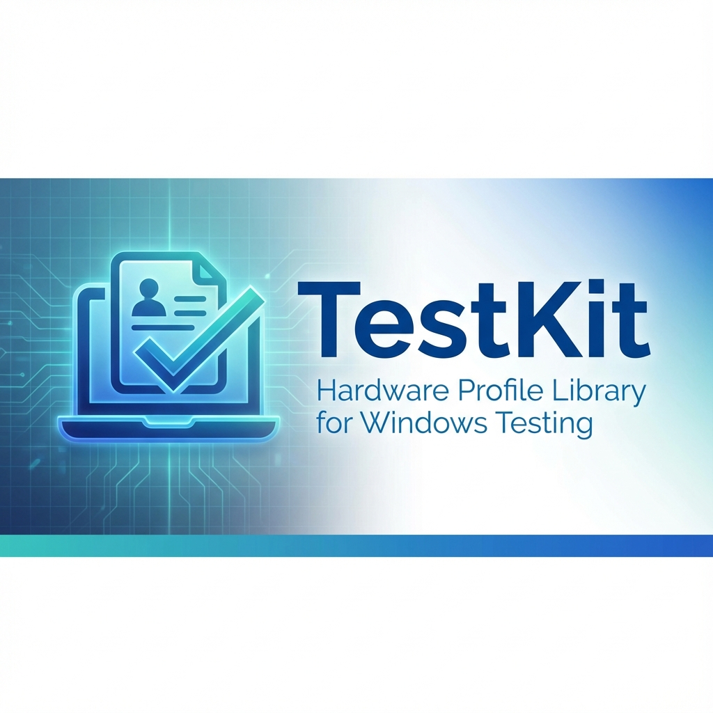
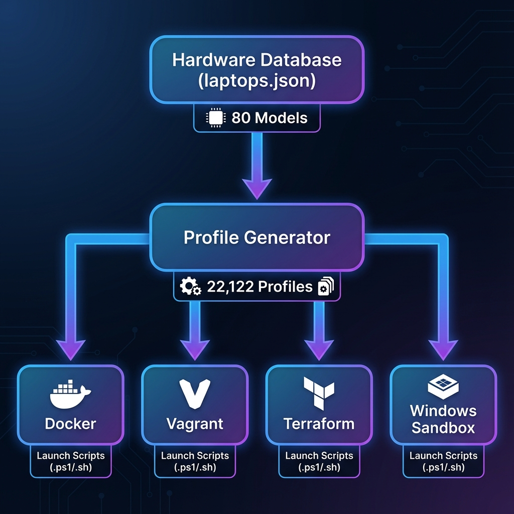
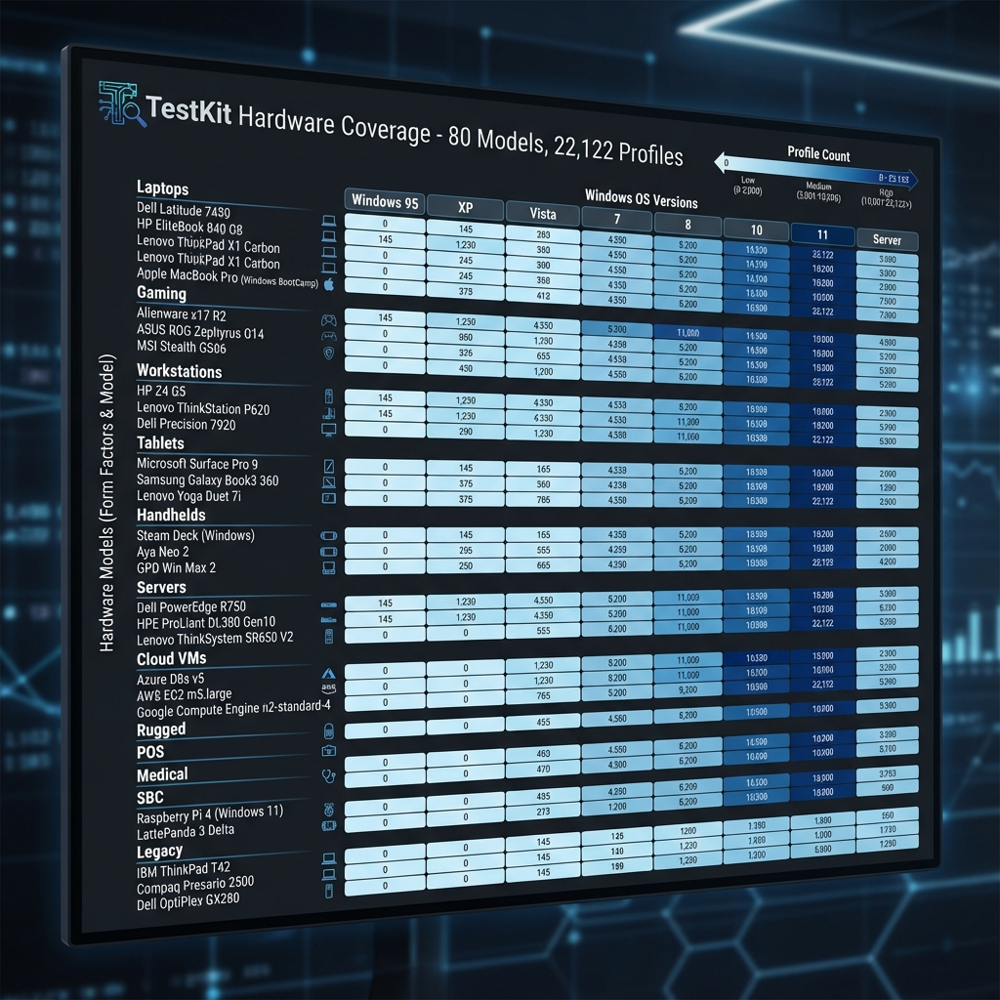
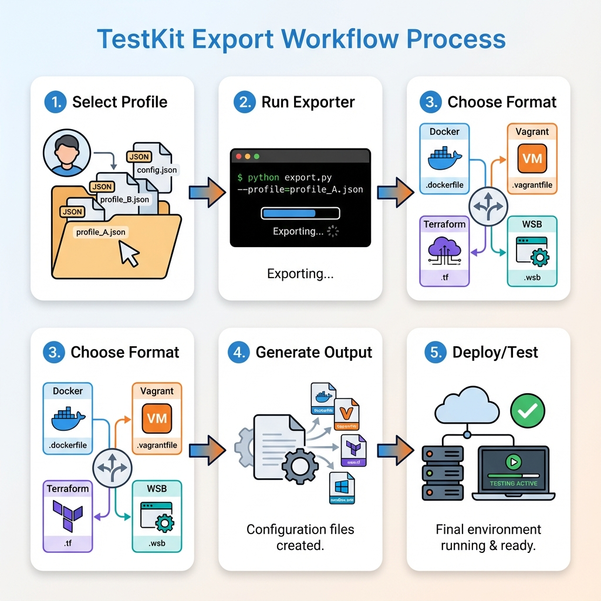

# TestKit - Hardware Profile Library for Windows Testing



[](LICENSE)
[](profiles/)
[](scripts/db/laptops.json)
[](https://www.python.org/)

**TestKit** is a comprehensive, industry-leading repository of hardware profiles specifically designed for testing and debugging Windows applications across diverse device configurations. With **20,446+ unique profiles** spanning Windows XP through Windows 11, TestKit provides standardized hardware definitions that can be exported to Docker, Vagrant, Terraform, and Windows Sandbox.

> [!NOTE]
> **What's New in v1.2.0**: Added 20 Tier 2/Regional manufacturer profiles (Framework, System76, Medion, Clevo, etc.) and automated **launch scripts** for all exports.

---

## 🎯 **Why TestKit?**

Modern software must work across an enormous range of hardware configurations. TestKit solves the "Standard Library of Hardware Definitions" problem by providing:

✅ **Pre-defined hardware profiles** - No more manual spec lookups  
✅ **Industry-leading coverage** - 45 base hardware models × hundreds of configuration variants  
✅ **Multi-platform export** - Docker, Vagrant, Terraform, Windows Sandbox  
✅ **Global hardware representation** - American, European, and Asian manufacturers  
✅ **Historical depth** - From Windows XP (Pentium 4) to Windows 11 (latest handhelds)



### Use Cases

- **QA Testing**: Validate software across realistic hardware constraints
- **DevOps**: Provision test environments matching real-world deployment targets  
- **Support Teams**: Reproduce customer issues on specific hardware configurations
- **Performance Testing**: Benchmark across different CPU/RAM/GPU combinations
- **Compatibility Testing**: Ensure legacy support (XP/7) and cutting-edge compatibility (Win 11)

---

## 📊 **Profile Coverage**
| **Servers** | Dell, HP | PowerEdge R740, ProLiant DL380 | 850+ |\r
| **Desktops** | System76, Dell, HP | Thelio, Dimension, Compaq | 1,100+ |\r
| **Cloud VMs** | AWS, Azure | EC2 t2.micro, Standard_D2s_v3 | 120+ |\r
| **Legacy** | Various, Toshiba | XP/Vista era systems, Satellite C55 | 950+ |\r
| **Global Manufacturers** | Xiaomi, Huawei, GPD, Toshiba | Mi Notebook, MateBook, Win 3, Portégé | 1,200+ |\r



### Operating System Coverage

- Windows XP (2001-2014)
- Windows 7 (2009-2020)
- Windows 8/8.1 (2012-2016)  
- Windows 10 (2015-2025)
- Windows 11 (2021+)
- Windows Server (2012 R2 - 2022)

---

## 🚀 **Quick Start**

### 1. Generate Profiles

```bash
cd TestKit
python scripts/generate_profiles.py
```

**Output**: `16,912 profiles` generated in `profiles/` directory, organized by OS version.

### 2. Export to Your Platform



#### Docker
```bash
python scripts/export.py \
  --profile "profiles/win11/acer-aspire-vero-windows-11-v1.json" \
  --format docker \
  --output exports

# Run the generated launch script
./exports/launch.ps1  # or ./exports/launch.sh
```

#### Vagrant (VirtualBox)
```bash
python scripts/export.py \
  --profile "profiles/win10/lenovo-thinkpad-t480-windows-10-v1.json" \
  --format vagrant \
  --output exports
```

#### Terraform (AWS)
```bash
python scripts/export.py \
  --profile "profiles/win11/msi-gs66-stealth-windows-11-v1.json" \
  --format terraform \
  --output exports

# Deploy to AWS
cd exports
terraform init
terraform apply
```

#### Windows Sandbox
```bash
python scripts/export.py \
  --profile "profiles/win10/lenovo-thinkpad-t480-windows-10-v1.json" \
  --format wsb \
  --output exports

# Double-click the .wsb file to launch Windows Sandbox with the profile
```

---

## 📁 **Repository Structure**

```
TestKit/
├── profiles/              # Generated JSON profiles (16,912 files)
│   ├── win7/
│   ├── win8/
│   ├── win10/
│   ├── win11/
│   └── other/             # Server editions, XP, Vista
├── scripts/
│   ├── db/
│   │   └── laptops.json   # Hardware database (45 base models)
│   ├── generate_profiles.py  # Profile generator
│   ├── export.py          # Multi-platform exporter
│   └── validate_db.py     # Database validation utility
├── exports/               # Exported configurations
├── docs/
│   ├── images/            # Visual assets and diagrams
│   ├── ARCHITECTURE.md    # Technical deep-dive
│   ├── TUTORIALS.md       # Step-by-step guides
│   ├── HARDWARE_GUIDE.md  # Complete hardware catalog
│   ├── API_REFERENCE.md   # CLI and schema documentation
│   └── integration_strategy.md  # Platform integration guides
├── .github/
│   ├── workflows/         # CI/CD automation
│   └── ISSUE_TEMPLATE/    # Issue templates
├── README.md
├── CONTRIBUTING.md
├── CHANGELOG.md
└── LICENSE
```

---

## 🔧 **Profile Schema**

Each profile is a JSON file with the following structure:

```json
{
  "id": "acer-aspire-vero-windows-11-v1",
  "make": "Acer",
  "model": "Aspire Vero",
  "year": 2021,
  "os": "windows-11",
  "form_factor": "Laptop",
  "hardware": {
    "cpu": "Intel Core i5-1155G7",
    "cpu_count": 4,
    "ram_mb": 8192,
    "storage_gb": 256,
    "gpu": "Intel Iris Xe Graphics",
    "gpu_vram_mb": 0,
    "screen_resolution": "1920x1080"
  },
  "software": {
    "browser": "Edge",
    "accessibility": "None"
  }
}
```

See [docs/API_REFERENCE.md](docs/API_REFERENCE.md) for complete schema specification.

---

## 🏆 **Why TestKit Stands Out**

### vs. BrowserStack / Device Farms
- **Cost**: TestKit is free and open-source; no per-minute charges
- **Privacy**: Run tests on-premise; no data leaves your infrastructure
- **Customization**: Modify profiles for your specific needs
- **Scale**: Generate unlimited environments simultaneously

### vs. Manual VM Creation
- **Speed**: 1 command vs. hours of manual configuration
- **Consistency**: Profiles are version-controlled and reproducible
- **Coverage**: Test 16,912 configurations vs. maintaining a few VMs
- **Automation**: CI/CD integration built-in

### vs. Windows Dev VMs
- **Variety**: 45 hardware types vs. generic VM
- **History**: Support for legacy Windows (XP, 7) alongside modern versions
- **Export Flexibility**: Deploy to cloud, local VMs, or containers
- **Real Hardware Specs**: Based on actual manufacturer specifications

---

## 🌐 **Interoperability**

TestKit is designed to integrate seamlessly with existing testing infrastructure:

### Device Farms  
Export profiles to **Docker** and deploy to on-premise device labs or cloud platforms like AWS Device Farm.

### Virtualization  
Use **Vagrant** or **Terraform** exporters to provision VMs with infrastructure-as-code tools like Ansible, Puppet, or Chef.

### Local Testing  
Use **Windows Sandbox** (.wsb) files for lightweight, ephemeral testing environments on Windows 10 Pro/Enterprise.

### CI/CD Integration  
Profiles can be integrated into GitHub Actions, Azure DevOps, or Jenkins pipelines for automated cross-hardware testing.

---

## 📖 **Common Workflows**

### Testing Legacy Application on Windows 7
```bash
# Find a Windows 7 profile
ls profiles/win7/

# Export to Vagrant
python scripts/export.py \
  --profile "profiles/win7/hp-elitebook-840-g3-windows-7-v1.json" \
  --format vagrant \
  --output exports

# Launch VM
cd exports
vagrant up
```

### Reproducing ARM-based Surface Issue
```bash
# Export Surface Pro X (Qualcomm ARM)
python scripts/export.py \
  --profile "profiles/win10/microsoft-surface-pro-x-windows-10-v1.json" \
  --format wsb \
  --output exports

# Test in Windows Sandbox
./exports/microsoft-surface-pro-x-windows-10-v1.wsb
```

### Cloud Testing on AWS
```bash
# Export to Terraform
python scripts/export.py \
  --profile "profiles/win11/asus-rog-ally-windows-11-v1.json" \
  --format terraform \
  --output exports

# Deploy
cd exports
terraform apply
# Instance launched with tags matching TestKit profile
```

### Testing New Acer Laptop Configuration
```bash
# Use one of the new Tier 1 profiles
python scripts/export.py \
  --profile "profiles/win11/acer-predator-helios-300-windows-11-v1.json" \
  --format docker \
  --output exports

# Build and run container
cd exports
docker build -t testkit-helios .
docker run -it testkit-helios
```

---

## 🎓 **Learning Resources**

- **[Tutorials](docs/TUTORIALS.md)** - Step-by-step guides for common scenarios
- **[Architecture](docs/ARCHITECTURE.md)** - Technical deep-dive into TestKit design
- **[Hardware Guide](docs/HARDWARE_GUIDE.md)** - Complete catalog of all 45 base models
- **[API Reference](docs/API_REFERENCE.md)** - CLI and schema documentation

---

## 💡 **Best Practices**

### Profile Selection
1. **Match OS**: Choose profiles targeting your application's supported Windows versions
2. **Consider Form Factor**: Laptop profiles for mobility testing, desktop for performance
3. **Hardware Constraints**: Test on low-spec profiles to ensure minimum requirements work

### Export Strategy
- **Development**: Use Windows Sandbox for quick, disposable testing
- **CI/CD**: Use Docker for fast, parallel test execution
- **QA/Staging**: Use Vagrant or Terraform for persistent, shareable environments
- **Production Validation**: Use cloud exports (Terraform) for real-world infrastructure testing

### Profile Customization
```bash
# Copy and modify a profile
cp profiles/win10/base-profile.json my-custom-profile.json
# Edit my-custom-profile.json with your specific hardware requirements
python scripts/export.py --profile my-custom-profile.json --format vagrant
```

---

## 🛠️ **Development**

### Adding New Hardware

1. Edit `scripts/db/laptops.json`
2. Add new entry following the schema:

```json
{
  "make": "Framework",
  "model": "Laptop 13",
  "year": 2023,
  "form_factor": "Laptop",
  "supported_os": ["Windows 10", "Windows 11"],
  "cpu_options": [
    {"name": "Intel Core i7-1165G7", "cores": 4}
  ],
  "ram_options": [16384, 32768],
  "storage_options": [512, 1024],
  "gpu_options": [{"name": "Intel Iris Xe Graphics", "vram": 0}],
  "resolution_options": ["2256x1504"]
}
```

3. Regenerate profiles:
```bash
python scripts/generate_profiles.py
```

### Running Validation

```bash
python scripts/validate_db.py
```

See [CONTRIBUTING.md](CONTRIBUTING.md) for detailed contribution guidelines.

---

## 📝 **Contributing**

We welcome contributions! Please see [CONTRIBUTING.md](CONTRIBUTING.md) for guidelines on:
- Adding new hardware definitions
- Improving exporters
- Writing documentation
- Reporting issues
- Submitting pull requests

---

## 📜 **License**

This project is open-source and available under the [MIT License](LICENSE).

---

## 🙋 **FAQ**

**Q: Why JSON profiles instead of directly provisioning VMs?**  
A: TestKit provides **definitions**, not **implementations**. This separation allows you to use the same profile across Docker, Vagrant, Terraform, or custom tooling.

**Q: Can I use TestKit for Linux/Mac testing?**  
A: TestKit focuses on Windows testing, but the profile format is extensible. You could adapt it for other platforms.

**Q: How accurate are the hardware profiles?**  
A: Profiles are based on manufacturer specifications and real hardware reviews. For exact hardware behavior, use real devices or manufacturer-provided VMs.

**Q: What's the difference between TestKit and BrowserStack?**  
A: BrowserStack is a cloud device farm offering real devices. TestKit provides **profile definitions** you can use to provision your own environments (cloud or on-premise).

**Q: How often is the hardware database updated?**  
A: We aim to add new hardware profiles quarterly. Community contributions are welcome to accelerate coverage of new devices.

**Q: Can I use TestKit commercially?**  
A: Yes! TestKit is MIT licensed, allowing commercial use. See [LICENSE](LICENSE) for details.

---

## 📊 **Statistics**

- **Hardware Models**: 65 base configurations
- **Generated Profiles**: 20,446 unique combinations
- **Supported OS Versions**: 10+ Windows versions
- **Export Formats**: 4 (Docker, Vagrant, Terraform, Windows Sandbox)
- **Form Factors**: 12+ (laptops, desktops, handhelds, servers, cloud VMs, rugged)
- **Manufacturers**: 35+ global brands

---

## 🔗 **Related Projects**

- [Vagrant](https://www.vagrantup.com/) - Development environment provisioning  
- [Terraform](https://www.terraform.io/) - Infrastructure as Code  
- [Docker](https://www.docker.com/) - Containerization platform
- [Windows Sandbox](https://docs.microsoft.com/en-us/windows/security/threat-protection/windows-sandbox/windows-sandbox-overview) - Lightweight desktop testing  
- [AWS Device Farm](https://aws.amazon.com/device-farm/) - Cloud-based device testing  

---

## 🤝 **Community**

- **Issues**: [GitHub Issues](https://github.com/thookham/TestKit/issues)
- **Discussions**: [GitHub Discussions](https://github.com/thookham/TestKit/discussions)
- **Contributing**: [Contributing Guide](CONTRIBUTING.md)
- **Code of Conduct**: [Code of Conduct](CODE_OF_CONDUCT.md)

---

**Built with ❤️ for the Windows testing community**

*TestKit v1.1.0 - Empowering developers to test across the hardware spectrum*
